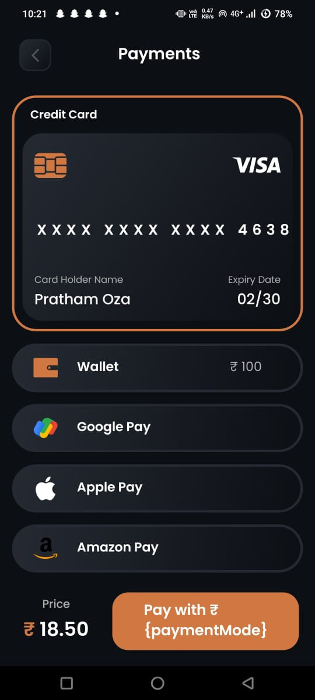
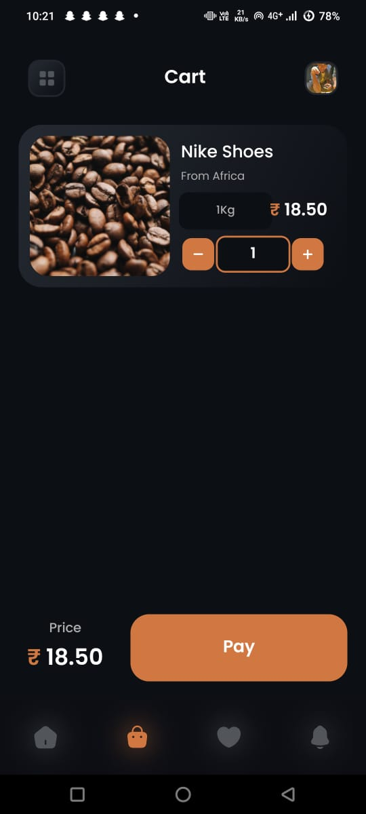

# Getting Started with Your Coffee Shop App

Welcome to your new Coffee Shop App built with [React Native](https://reactnative.dev)! This guide will help you get started with running and modifying your app.

## Step 1: Start the Metro Server

First, let's start **Metro**, the JavaScript bundler that comes with React Native.

Open a terminal and navigate to the root of your Coffee Shop project. Then, run:

```bash
# using npm
npm start

# OR using Yarn
yarn start
```

## Step 2: Start Your Coffee Shop App

While Metro Bundler is running in its own terminal, open another terminal at the root of your project and run the following command to start your app:

### For Android

```bash
# using npm
npm run android

# OR using Yarn
yarn android
```

### For iOS

```bash
# using npm
npm run ios

# OR using Yarn
yarn ios
```

If everything is set up correctly, you should see your Coffee Shop app running in your Android Emulator or iOS Simulator shortly.

## Step 3: Modifying Your App

Now that your app is up and running, let's make some modifications.

1. Open `App.tsx` in your preferred text editor and make changes to customize it for your Coffee Shop.
2. For Android: Press the <kbd>R</kbd> key twice or select **"Reload"** from the **Developer Menu** (<kbd>Ctrl</kbd> + <kbd>M</kbd> on Windows and Linux, or <kbd>Cmd ⌘</kbd> + <kbd>M</kbd> on macOS) to see your changes.
   For iOS: Press <kbd>Cmd ⌘</kbd> + <kbd>R</kbd> in your iOS Simulator to reload the app and see your changes.

## Congratulations! 🎉

You've successfully run and modified your Coffee Shop app. ☕️
## Adding a Screenshot





### What's Next?

- If you want to integrate this React Native code into an existing application, check out the [Integration guide](https://reactnative.dev/docs/integration-with-existing-apps).
- To learn more about React Native, visit the [React Native website](https://reactnative.dev).
- Explore the basics of React Native with the [Getting Started guide](https://reactnative.dev/docs/getting-started).


Feel free to adjust any part of this guide to better suit your specific needs! Let me know if you need further assistance.
